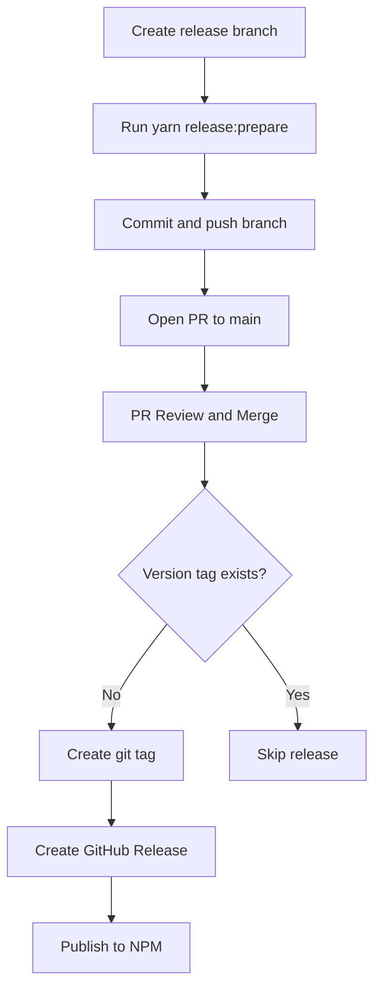

# Release Process

This document outlines the release process for the Nuxt UTM module.

## Release Workflow

We follow a PR-based release process that works with protected branches:



1. **Create a Release PR**:

   - Version bump in `package.json`
   - CHANGELOG update
   - Open PR for review

2. **Automated Release (GitHub Actions)**:
   - Triggered automatically when the PR is merged to main
   - Detects the new version and creates a git tag
   - Creates a GitHub Release
   - Publishes the package to NPM

## Creating a Release

1. Ensure you have the latest changes from the main branch:

   ```bash
   git checkout main
   git pull origin main
   ```

2. Create a release branch:

   ```bash
   git checkout -b release-X.Y.Z
   ```

3. Make sure all tests pass:

   ```bash
   yarn test
   ```

4. Run the release script, which will:

   - Bump the version in `package.json`
   - Update the `CHANGELOG.md`

   ```bash
   yarn release:prepare
   ```

5. Commit and push the release branch:

   ```bash
   git add .
   git commit -m "chore: release vX.Y.Z"
   git push -u origin release-X.Y.Z
   ```

6. Open a Pull Request to `main` and get it reviewed.

7. Once the PR is merged, the CI will automatically:
   - Detect the new version
   - Create a git tag (`vX.Y.Z`)
   - Create a GitHub Release
   - Trigger the NPM publish workflow

## Automated Release Detection

The [release-on-merge.yml](../.github/workflows/release-on-merge.yml) workflow runs on every push to `main` that modifies `package.json`. It:

1. Reads the version from `package.json`
2. Checks if a git tag for that version already exists
3. If no tag exists, creates the tag and a GitHub Release
4. The GitHub Release triggers the [npm-publish.yml](../.github/workflows/npm-publish.yml) workflow

## Version Numbering

We follow [Semantic Versioning](https://semver.org/) for this project:

- **MAJOR** version for incompatible API changes
- **MINOR** version for backwards-compatible functionality additions
- **PATCH** version for backwards-compatible bug fixes

## Troubleshooting

If the automated release fails:

1. Check the GitHub Actions logs for errors
2. Ensure the `npm_token` secret is correctly set in the repository settings
3. Verify that the version in `package.json` hasn't already been published
4. If the release workflow failed but the tag was created, you can manually trigger the `npm-publish` workflow

If a release was skipped:

1. The workflow only runs when `package.json` is modified
2. Check if the git tag already exists for the version
3. You can manually trigger the release by creating a GitHub Release

## Additional Notes

- The release process uses [changelogen](https://github.com/unjs/changelogen) to generate CHANGELOG entries
- Always verify that the published package works correctly by installing it in a test project
- The main branch is protected; all releases must go through a PR

---

For questions or assistance with the release process, please contact the maintainers or email [community@stackbuilders.com](mailto:community@stackbuilders.com).
